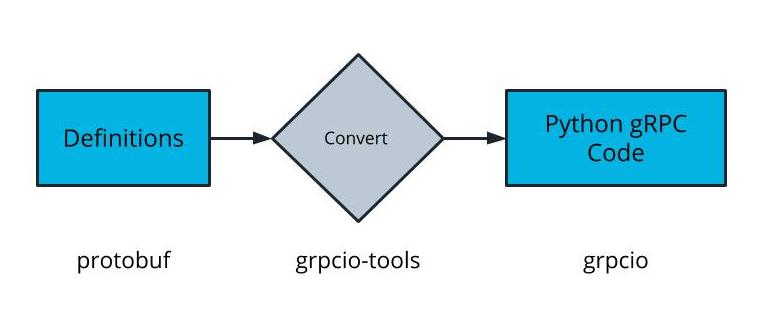

## How to Use gRPC

## Using gRPC With Python

Implementing gRPC with Python involves two libraries:

* `grpcio` to run client and server code
* `grpcio-tools` to generate definition code.



Translating protobuf Messages Into Python Code

## Creating a gRPC Client and Server

1. Define a protobuf request messages, response messages, and service in a .proto file.
2. Use grpcio-tools command on the .proto file to generate a pair of Python files representing the messages and the services.
3. Import the pair of Python files into your application logic and implement your client/server.

**Example**

**Step 1: Define .proto file**
```protobuf
message Item {
  string name = 1;
  string brand_name = 2;
  int32 id = 3;
  float weight = 4;
}
```
Store this in an `item.proto` file and declare a service that uses it:

```protobuf
syntax = "proto3";

message ItemMessage {
  string name = 1;
  string brand_name = 2;
  int32 id = 3;
  float weight = 4;
}

service ItemService {
    rpc Create(ItemMessage) returns (ItemMessage);
}
```
**Remember**: `item-proto` is used only to generate the Python files.

**Step 2: Generate gRPC Files**

Using `grpcio-tools`, generate a pair of files that can be directly imported into our Python code:

`grpc_tools.protoc -I./ --python_out=./ --grpc_python_out=./ item.proto`

The path `./`, can be replaced with another path or an absolute path to your `.proto` file.

The files `item_pb2.py` and `item_pb2_grpc.py` should have been generated.

**Step 3: Import gRPC Files**

Import the files to your application to use class definitions.
```python
import item_pb2
import item_pb2_grpc
```
Creating a message with data would look like the following:
```python
item = item_pb2.ItemMessage(
               name="Hair Dryer",
               brand_name="Dry King",
               id=34,
               weight=1.2
           )
```
### gRPC Demo Part I

### Follow Along

To follow along with the demo, you can use the starter code here: [gRPC Demo Source Code](https://github.com/udacity/cd0309-message-passing-exercises/tree/master/lesson-3-implementing-message-passing/grpc-demo)

### Summary
**Create Protobuf File**

* Create `item.proto` file
* Specify `proto3` syntax
* Define an `ItemMessage`
* Define `ItemService` with a `Create` method using `ItemMessage`

**Generate gRPC Files**

* Install `grpc-io` with `pip install grpcio-tools`
* Verify installation with `pip list`
* Run the `grpc-io` command in the same directory as `item.proto`. The command can be hard to remember so it's useful to save it in a README
* `item_pb2.py` and `item_pb2_grpc.py` should have been created

**Install gRPC for Python**

* Install `grpcio` with `pip install grpcio`
* This may have already been installed when `grpcio-tools` was installed

**Generated Files**

* `item_pb2_grpc.py` and `item_pb2.py` should not be edited. The files even have lines that explicitly state `DO NOT EDIT!`.

### gRPC Demo Part II

**Summary**

**gRPC Server**

* gRPC server logic is implemented in `main.py`
* `grpc` is imported to use gRPC in Python code
* `item_pb2` and `item_pb2_grpc` is imported to handle the `ItemMessage` and `ItemService` that was defined in the `.proto` file
* `ItemServicer` is the implementation of the `ItemService` protobuf stub
* `Create` in `ItemServicer` defines our custom logic. It is set up in a simple manner where a Python `dict` is printed and returned as an `item_pb2.ItemMessage` object instead of an unstructured `dict`
* The file handles a lot of boilerplate for setting up a gRPC server since we aren't using a framework like Flask that can reduce boilerplate

**Running the gRPC Server**

* python main.py will serve the gRPC server on localhost:5005 import gprc to use gRPC

### gRPC Demo Part III

**Summary**

**Create gRPC Client**

* gRPC client logic is implemented in `writer.py`
* `grpc` is imported to use gRPC in Python code
* `item_pb2` and `item_pb2_grpc` is imported to handle the `ItemMessage` and `ItemService` that was defined in the `.proto` file. These files don't need to be regenerated.
* Client is configured to send messages to `localhost:5005` where the gRPC server is running.
* `iteM_pb2.ItemMessage` object is created with expected fields and values.

**Running the gRPC Client**

* `python writer.py` will run the gRPC client
* Changing tabs to where the gRPC server is running, it prints the payload that was passed by the gRPC client

**Showcasing Type Checking**

* Change the value of `brand_name` from a `string` to an `integer` in `writer.py`
* `python writer.py` to run the gRPC client will return an error that `brand_name` should be a `string`.

### New Terms
|Term	|Definition|
|-------|----------|
|grpcio	|A Python library used to run gRPC client and gRPC server code|
|grpcio-tools	|Python library of tools that help generate definition code used by gRPC|

### Learn More About Using gRPC

The following are some resources to learn more about how large organizations use gRPC:

* [gRPC Used in Netflix Tools](https://netflixtechblog.com/evolution-of-netflix-conductor-16600be36bca)
* [Dropbox Migration to gRPC](https://dropbox.tech/infrastructure/courier-dropbox-migration-to-grpc)